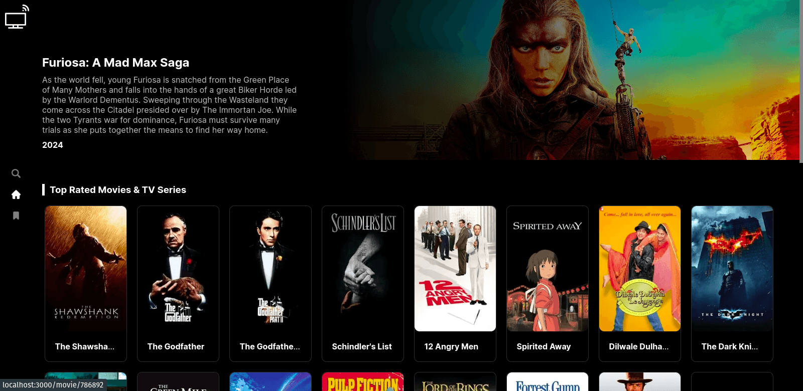
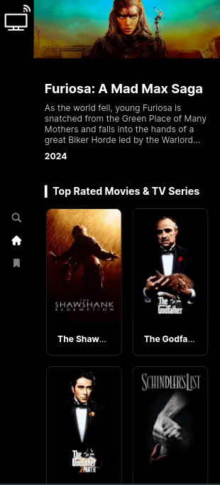
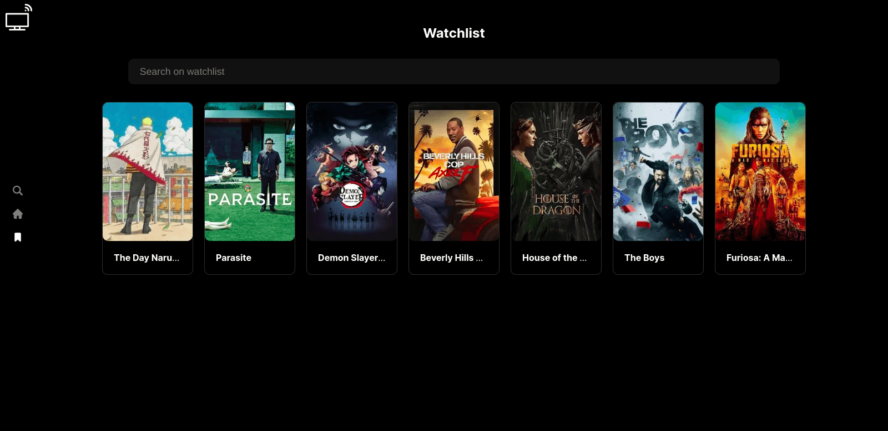
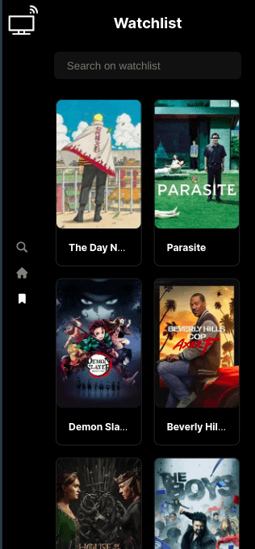
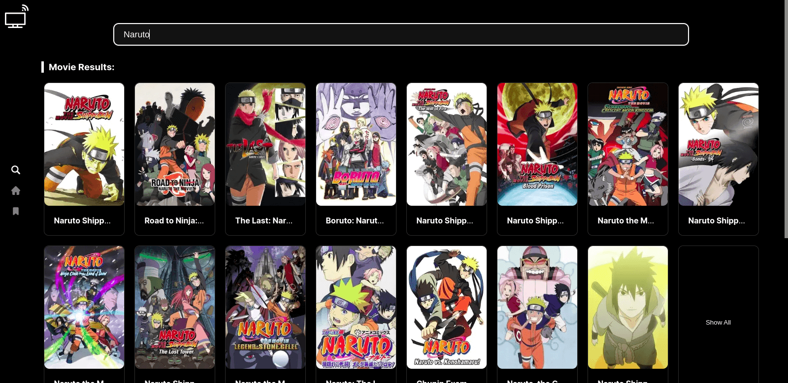
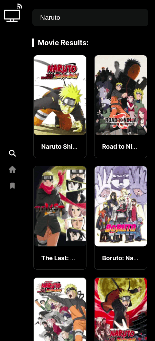
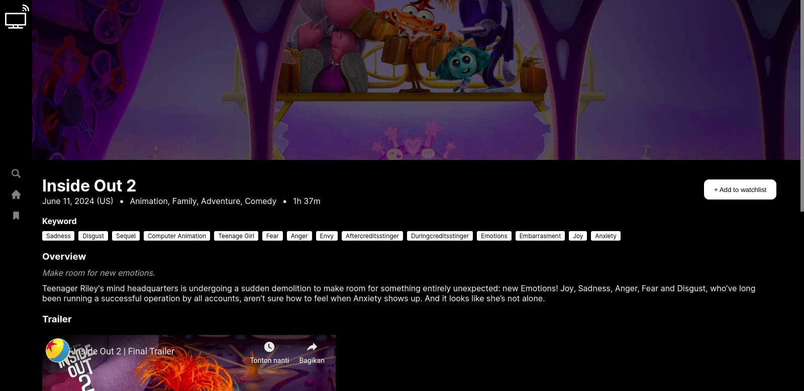
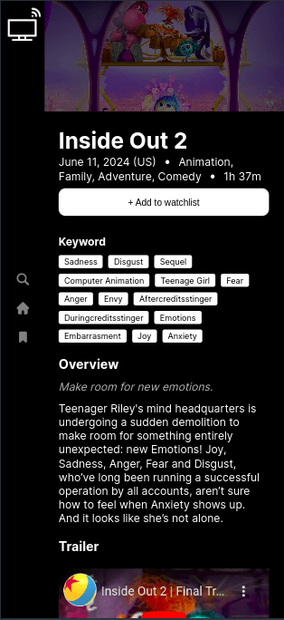
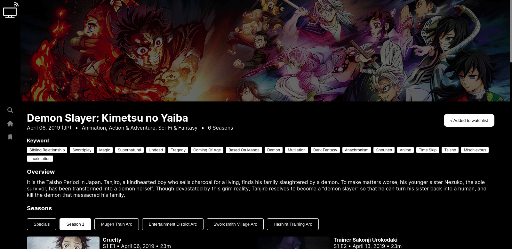
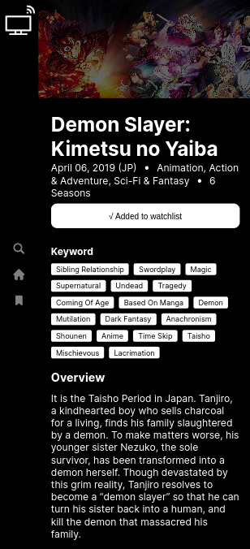

# Hotstar123

This app show movie, and tv show in entertainment, you can check detail for each content, search for content, and save your watchlist movie or tv show. The data is provided by [Themoviedb](https://www.themoviedb.org/). You can check the deployed app on [Hotstar123](https://hotstar123-clone.vercel.app/).

## Local Setup

### Get Themoviedb API key

To running this web you need to get api key from Themoviedb, this key will be used for fetching data. Go to [https://developer.themoviedb.org/](https://developer.themoviedb.org/) to get your key.

### Setup env variable

After you get the key, you need set this key on env variable, create file on project root called ".env.local", and put the key:

```bash
NEXT_PUBLIC_MDB_TOKEN={your-key}
```

### Install dependencies

Before you ready to run the web, you need install all required dependencies, use **Node.js 18.17 or later**. run this command on root of project:

```bash
npm run install
```

### Run the web

And thats all, now you ready to run the web, hit this command:

```bash
npm run dev
```

## Preview

### Home

| Desktop              | Mobile               |
| -------------------- | -------------------- |
|  |  |

### Watchlist

| Desktop              | Mobile               |
| -------------------- | -------------------- |
|  |  |

### Search

| Desktop              | Mobile               |
| -------------------- | -------------------- |
|  |  |

### Movie Detail

| Desktop              | Mobile               |
| -------------------- | -------------------- |
|  |  |

### Tv Detail

| Desktop              | Mobile                 |
| -------------------- | ---------------------- |
|  |  |

## Technologies

This project uses several technologies listed below :

- **[NextJs](https://nextjs.org/docs)**, the React Framework for Production.
- **[Typescript](https://www.typescriptlang.org/)**, a strict syntactical superset of JavaScript and adds optional static typing to the language.
- **[React Context](https://reactjs.org/docs/context.html)**, context lets you “broadcast” such data, and changes to it, to all components below.
